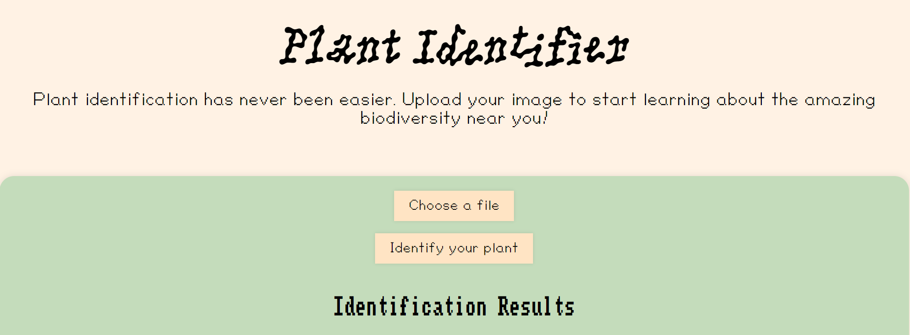

# Plant Identifier
You can now visit the website at https://plant-identification.vercel.app/ !!!!

While hiking or on a casual walk, I often find myself looking to identify common plants around my area to appreciate the biodiversity. Therefore, I am made a website using HTML, CSS, JavaScript, Node.js, Express.js, and Plant Net's API.

## Features
- Upload an image of a plant
- Identify the plant using PlantNet API
- View the result by the plant's species name, family, genus, image, and gain confidence of the result by the similarity score
- Export results to a CSV file

## Building my First Website
As a first experience to dive head-first into handling APIs was a learning curve that taught me a lot. The different methods of POST and GET caused me a lot of headaches but ultimately helped me improve my JavaScript and API experience. 

The biggest bug I found was related to uploading the image of the user from the form to the uploads directory which was read-only for a lot of the deployment sites. Finally, Vercel's detailed logs helped me figure out that I needed an external temporary storage system for the uploads. Thus, I transformed the code to handle from Imgur without storing the image locally temporarily. 

I had so much fun with this project and want to keep adding small features to it. However, for now, the core features of the website are functional.

## Credits for Fonts

PicNic by Mariel Nils. Distributed by velvetyne.fr.

The FontStruction “Amiga Topaz” by Patrick Lauke